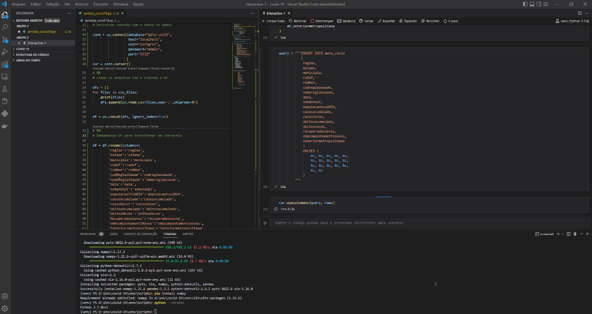
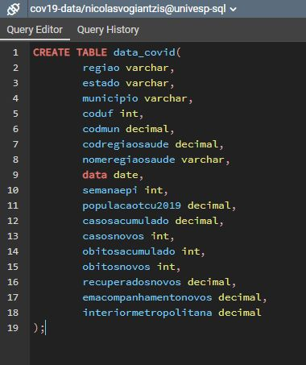
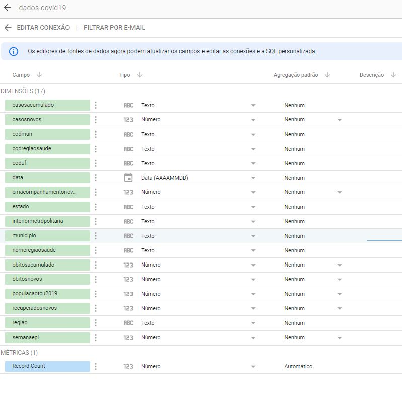
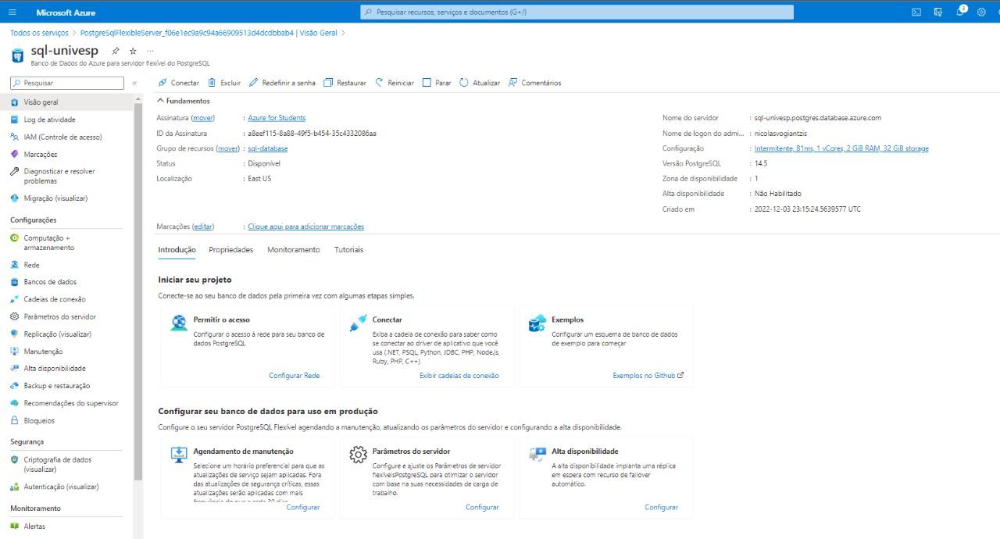

# Covid-19

# Projeto Integrador VIII - Universidade Virtual do Estado de São Paulo - UNIVESP
# Tema: Ferramenta para identificação de Crescimento Elevado da COVID-19 

## Sobre o Projeto
##### O script foi criado para tratar os dados coletados no site https://covid.saude.gov.br/ .
##### Os dados foram concatenados e inseridos no banco de dados PostgreSQL.
##### Neste Projeto Criamos um banco de Dados no Azure para hospedar os dados e dispobilizar para a criação do Dashboard na Ferramenta de BI Google Data Studio.

# Imagens do Desenvolvimento 
<!--Imagens session-->

  

# Imagens do Script tabela  

  

# Imagens da Leitura de Tabela do Google Data Studio 

  

# Imagens Painel Azure com a Instância do Banco de Dados

  

### Integrantes do Grupo: Carlos Roberto Watarai RA: 1825492 / Leandro V. S. Pereira RA: 1834509 / Nicolas Vogiantzis RA: 1820026 / Renan Rodrigues RA: 1819723

